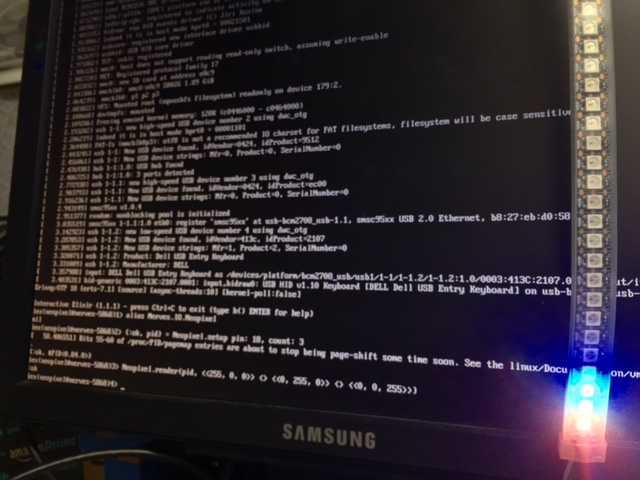

# Nerves.Neopixel

Drive WS2812B "NeoPixel" RGB LED strips from a Raspberry Pi using Elixir!



This project was designed to make it easy to drive a string of AdaFruit
NeoPixels from a Raspberry Pi using [Nerves](http://nerves-project.org). The
code would probably also work outside of Nerves with minor modifications to the
Makefile, if you so desire.

Unfortunately, since the Raspberry Pi has 3.3V I/O outputs and the NeoPixels
require 5V I/O input, a little piece of hardware is required. You can read more
about this in [my blog post about the
project](http://www.gregmefford.com/blog/2016/01/22/driving-neopixels-with-elixir-and-nerves).

## Installation

1.  Add it to your list of dependencies in `mix.exs`:

    ```elixir
    def deps do
      [{:nerves_neopixel, "~> 0.3.1"}]
    end
    ```

2. Ensure it is started before your application:

    ```elixir
    def application do
      [applications: [:nerves_neopixel]]
    end
    ```

## Usage

Supervision trees and an Elixir `Port` are used to maintain fault-tolerance when
interfacing with the low-level driver, which is written in C. To drive an
NeoPixel strip, you just have to configure which GPIO pin to use and how many
NeoPixels are in the strip by passing the configuration settings to
`Nerves.NeoPixel.start_link`.

Once the process is started, you can call the `Nerves.Neopixel.render` function
with a list of tuples representing the pixel data, along with the overall
intensity, as follows:

```elixir
alias Nerves.Neopixel
ch0_config = [pin: 18, count: 3]
ch1_config = [pin: 19, count: 3]
{:ok, pid} = Neopixel.start_link(ch0_config, ch1_config)

channel = 0
intensity = 127
data = [
  {255, 0, 0},
  {0, 255, 0},
  {0, 0, 255},
]
Neopixel.render(channel, {intensity, data})
```
