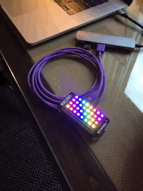

# Blinkchain

[](https://coveralls.io/github/GregMefford/blinkchain?branch=master)

Drive WS2812B "NeoPixel" RGB LED strips from a Raspberry Pi using Elixir!



This project was designed to make it easy to drive a string of AdaFruit
NeoPixels from a Raspberry Pi using [Nerves](http://nerves-project.org). The
code would probably also work outside of Nerves with minor modifications to the
Makefile, if you so desire.

> NOTE: This library used to be called `nerves_neopixel`. The reason for the
> new name and major version bump is that I wanted to overhaul the API and
> also make it less-specific to Nerves and NeoPixels. For example, it could be
> used in the future to control DotStar LED chains from Raspbian Linux.
>
> If you're looking for the source for the last version of `nerves_neopixel`,
> you can find it [here](https://github.com/GregMefford/blinkchain/tree/v0.4.0).

## Installation

Add it to your list of dependencies in `mix.exs`:

```elixir
  def deps do
    [{:blinkchain, "~> 1.0"}]
  end
```

If you've cloned the `blinkchain` repository, be sure to check out the
`rpi_ws281x` submodule:

```sh
$ git submodule init
$ git submodule update
```

## Connections

Only a subset of GPIO pins on the Raspberry Pis can control the NeoPixels. See
[GPIO Usage](https://github.com/jgarff/rpi_ws281x#gpio-usage) for details.
Additionally, since the Raspberry Pi has 3.3V I/O outputs and the NeoPixels
require 5V I/O input, you'll need a level shifter to convert between voltages.

You can read more about using NeoPixels with Nerves in [my blog post about the
project](http://www.gregmefford.com/blog/2016/01/22/driving-neopixels-with-elixir-and-nerves).

## Usage

Supervision trees and an Elixir `Port` are used to maintain fault-tolerance
when interfacing with the low-level driver, which is written in C. For example,
let's imagine that you want to drive a [Pimoroni Unicorn pHAT], which has a
grid of 8 by 4 NeoPixels, and an [Adafruit NeoPixel Stick], which has a row of
8 NeoPixels. If we put the Stick next to the pHAT, we can imagine a virtual
drawing canvas that is 8 pixels wide and 5 pixels tall, like so:

[Pimoroni Unicorn pHAT]: https://shop.pimoroni.com/products/unicorn-phat
[Adafruit NeoPixel Stick]: https://www.adafruit.com/product/1426

```
# Y  X: 0  1  2  3  4  5  6  7
# 0  [  0  1  2  3  4  5  6  7 ] <- Adafruit NeoPixel Stick on Channel 1 (pin 13)
#    |-------------------------|
# 1  |  0  1  2  3  4  5  6  7 |
# 2  |  8  9 10 11 12 13 14 15 | <- Pimoroni Unicorn pHat on Channel 0 (pin 18)
# 3  | 16 17 18 19 20 21 22 23 |
# 4  | 24 25 26 27 28 29 30 31 |
#    |-------------------------|
```

First, you need to configure which GPIO pin(s) to use and how the pixels are
arranged in each chain on the virtual drawing canvas:

```elixir
# config/config.exs
use Mix.Config

config :blinkchain,
  canvas: {8, 5}

config :blinkchain, :channel0,
  pin: 18,
  type: :grb,
  brightness: 32,
  gamma: gamma,
  arrangement: [
    %{
      type: :matrix,
      origin: {0, 1},
      count: {8, 4},
      direction: {:right, :down},
      progressive: true
    }
  ]

config :blinkchain, :channel1,
  pin: 13,
  type: :grb,
  brightness: 32,
  gamma: gamma,
  arrangement: [
    %{
      type: :strip,
      origin: {0, 0},
      count: 8,
      direction: :right
    }
  ]
```

Then, in your application code, you can use the various [Blinkchain API]
drawing commands to set the color of each pixel on the virtual canvas before
calling `Blinkchain.render/0` to present the virtual canvas onto the physical
NeoPixel LEDs. For example, to generate a scrolling rainbow pattern, assuming
that `c1` through `c5` are updated for each frame, you can do:

[Blinkchain API]: https://hexdocs.pm/packages/blinkchain

```elixir
# lib/rainbow/worker.ex

# Shift all pixels to the right
Blinkchain.copy(%Point{x: 0, y: 0}, %Point{x: 1, y: 0}, 7, 5)

# Populate the five leftmost pixels with new colors
Blinkchain.set_pixel(%Point{x: 0, y: 0}, c1)
Blinkchain.set_pixel(%Point{x: 0, y: 1}, c2)
Blinkchain.set_pixel(%Point{x: 0, y: 2}, c3)
Blinkchain.set_pixel(%Point{x: 0, y: 3}, c4)
Blinkchain.set_pixel(%Point{x: 0, y: 4}, c5)

Blinkchain.render()
```

To see more about how this code works or try it out for yourself, check out
[the included `rainbow` example](https://github.com/GregMefford/blinkchain/examples/rainbow).
